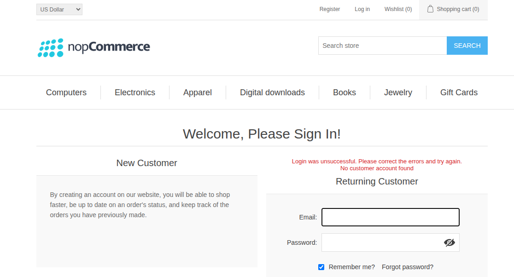

# BUG-001: Empty password displays an incorrect credentials message

**Website:** https://demo.nopcommerce.com/
**Feature:** Login
**Date:** 23 September 2026
**Environment:** Chrome on Pop!_OS
**Severity:** Low
**Priority:** Medium
**Status:** Open
**Reproducibility:** 100%

## Description

When a registered email address is entered and the password field is left empty, the login form reports that the credentials are incorrect. It does not explain that the required password is missing.

## Preconditions

- A registered customer account exists.
- The user is logged out.

## Steps to Reproduce

1. Open the nopCommerce Demo Store.
2. Click **Log in**.
3. Enter a registered email address.
4. Leave the password field empty.
5. Click **Log in**.

## Expected Result

The user should not be logged in. A clear validation message such as “Password is required” should be displayed.

## Actual Result

The user is not logged in. The following messages are displayed:

- “Login was unsuccessful. Please correct the errors and try again.”
- “The credentials provided are incorrect”

## Impact

The message is misleading because it suggests that an entered password is incorrect, although the password field was empty.

## Evidence

